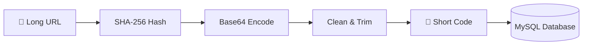

# 🔗 Secure URL Shortener

> **Hash + Base64 • Fast • Secure • Deterministic**

A lightweight, secure URL shortening service built with Python Flask and MySQL. Uses SHA-256 hashing combined with Base64 encoding to generate unique, deterministic short codes.


---

## ✨ Features

| Feature | Description |
|---------|-------------|
| 🔐 **Secure Hashing** | Uses SHA-256 algorithm for cryptographic security |
| 🔄 **Deterministic** | Same URL always generates same short code |
| ⚡ **Fast Lookup** | Indexed database for quick redirects |
| 🎨 **Modern UI** | Clean, responsive interface with gradient design |
| 📱 **Responsive** | Works seamlessly on desktop and mobile |
| 🔗 **Collision-Free** | URL-safe Base64 encoding prevents duplicates |

---

## 🛠️ Tech Stack

```
├── Backend
│   ├── Python 3.x
│   ├── Flask (Web Framework)
│   └── MySQL Connector
│
├── Frontend
│   ├── HTML5 / CSS3
│   ├── Jinja2 Templates
│   └── Font Awesome Icons
│
└── Database
    └── MySQL
```

---

## 🚀 Quick Start

### Prerequisites

- Python 3.x installed
- MySQL Server running
- pip package manager

### 1️⃣ Clone the Repository

```bash
git clone https://github.com/YOUR_USERNAME/url-shortener-hash-base64.git
cd url-shortener-hash-base64
```

### 2️⃣ Install Dependencies

```bash
pip install -r requirements.txt
```

### 3️⃣ Setup Database

Run the SQL script in your MySQL client:

```sql
CREATE DATABASE url_shortener;
USE url_shortener;

CREATE TABLE urls (
    id INT AUTO_INCREMENT PRIMARY KEY,
    original_url TEXT NOT NULL,
    short_code VARCHAR(10) UNIQUE NOT NULL
);

CREATE INDEX idx_short_code ON urls(short_code);
```

### 4️⃣ Configure Database Connection

Edit `app.py` and update the database credentials:

```python
db = mysql.connector.connect(
    host="localhost",
    user="root",
    password="your_password",  # Update this
    database="url_shortener"
)
```

### 5️⃣ Run the Application

```bash
python app.py
```

🎉 Open your browser and visit `http://localhost:5000`

---

## 📁 Project Structure

```
url-shortener-hash-base64/
│
├── 📄 app.py              # Flask application & routes
├── 📄 database.sql        # Database schema
├── 📄 requirements.txt    # Python dependencies
│
├── 📂 templates/
│   ├── index.html         # Homepage with URL input form
│   └── result.html        # Short URL display page
│
└── 📂 static/
    └── style.css          # Custom styles
```

---

## ⚙️ How It Works



1. **Input** - User submits a long URL
2. **Hash** - SHA-256 generates a secure hash digest
3. **Encode** - Base64 URL-safe encoding is applied
4. **Clean** - Non-alphanumeric characters are removed
5. **Trim** - First 6 characters form the short code
6. **Store** - URL and code are saved to MySQL
7. **Redirect** - Short URL redirects to original destination

---

## 🔌 API Endpoints

| Method | Endpoint | Description |
|--------|----------|-------------|
| `GET` | `/` | Homepage with URL input form |
| `POST` | `/` | Submit URL for shortening |
| `GET` | `/<short_code>` | Redirect to original URL |

---

## 📊 Database Schema

```sql
┌─────────────────────────────────────────────────┐
│                     urls                         │
├───────────────┬──────────┬──────────────────────┤
│ Column        │ Type     │ Constraints          │
├───────────────┼──────────┼──────────────────────┤
│ id            │ INT      │ PRIMARY KEY, AUTO    │
│ original_url  │ TEXT     │ NOT NULL             │
│ short_code    │ VARCHAR  │ UNIQUE, NOT NULL     │
└───────────────┴──────────┴──────────────────────┘
```

---

## 🎯 Future Enhancements

- [ ] Click analytics & statistics
- [ ] Custom short codes
- [ ] Expiration dates for URLs
- [ ] QR code generation
- [ ] User authentication
- [ ] API rate limiting
- [ ] Redis caching for faster lookups

---

## 🤝 Contributing

Contributions are welcome! Feel free to:

1. Fork the repository
2. Create your feature branch (`git checkout -b feature/amazing-feature`)
3. Commit your changes (`git commit -m 'Add amazing feature'`)
4. Push to the branch (`git push origin feature/amazing-feature`)
5. Open a Pull Request

---

## 📄 License

This project is licensed under the MIT License - see the [LICENSE](LICENSE) file for details.

---

## 👨‍💻 Author

**Kamesh A**

- 📧 Email: kameshanbu13@gmail.com
- 📱 Phone: +91 98947 38057

---

<div align="center">

**Made with ❤️ by [MVGlobe](https://mvglobe.in/)**

⭐ Star this repo if you found it helpful!

</div>
